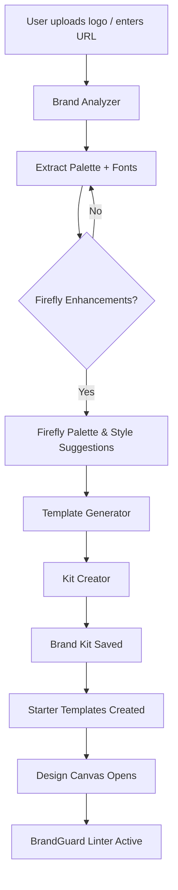

# BrandGenie – AI Brand Kit Generator Add-on

## 1. Elevator Pitch / Solution Overview
Small businesses and creators often struggle with building a cohesive brand look in Adobe Express. **BrandGenie** turns any logo or website URL into a fully-fledged Brand Kit (colors, typography, imagery style, and starter templates) in <30 seconds, directly inside Adobe Express. The add-on uses Adobe Firefly, palette extraction, and font recommendation models to deliver on-brand assets instantly, letting users jump straight into designing without the "blank-canvas" fear.

## 2. Problem Statement
• Manual Brand Kit creation is time-consuming and requires design expertise.
• Inconsistent branding leads to off-brand social posts and lost trust.
• Existing Express Brand Kits are powerful but under-utilised due to setup friction.

## 3. Proposed Solution
BrandGenie simplifies brand onboarding:
1. **Input** – User uploads a logo SVG/PNG or enters a public website URL.
2. **Analysis** – Service extracts dominant colors, imagery style, and scrapes CSS fonts if URL given.
3. **Generation** –
   • Color palette refined with Adobe Color rules & Firefly suggestions.
   • Matching Google/Adobe fonts recommended via embedding similarity search.
   • Three starter templates (Post, Story, Flyer) auto-generated with Firefly imagery & text-effect prompts.
4. **Brand Kit Creation** – Kit saved to user’s Brand Kits and shared across devices.
5. **BrandGuard (bonus)** – Real-time linter warns when off-brand fonts/colors are applied.

## 4. Key Features
• One-click Brand Kit generation from logo/URL.
• AI-enhanced color & typography suggestions with accessibility contrast checks.
• Starter template pack delivered into "My Projects" for immediate editing.
• BrandGuard overlay that highlights violations as you design (optional toggle).
• Export/Share brand guidelines PDF.

## 5. Alignment with Judging Criteria
| Criterion | How BrandGenie Excels |
|-----------|-----------------------|
| **Value for Express Users** | Removes brand setup friction, especially for SMBs and educators; immediate ROI. |
| **Innovation / Uniqueness** | Combines Firefly generative design, palette extraction, and live brand linting—no current Express add-on offers this workflow. |
| **Feasibility & Intent to Build** | Relies on publicly documented Express Add-on SDK & Firefly APIs; core prototype achievable in hackathon week (see architecture). |
| **Relevance to Prize Categories** | Competes strongly for “Most Valuable to Express Users” and “Best AI-Enhanced Experience”. |
| **Clarity of Concept** | Straightforward story: logo → Brand Kit → on-brand content. Easy to demo in 3-minute video. |

## 6. Technical Architecture & Stack
```
[User] → BrandGenie Panel (React + Typescript) → Node.js Service (Cloudflare Workers) →
   ├─ Firefly Gen-AI APIs (palette, templates images)
   ├─ Brand Analysis (ColorThief / Vibrant.js, Font Similarity Model)
   └─ Adobe Express Add-on SDK (BrandKit & Template APIs)
DB: Durable Objects / SQLite for caching analysed logos and suggested kits
CI/CD: GitHub Actions → Adobe IO Developer Console integration for dev → prod
```

### Primary Libraries / APIs
- `@adobe/express-addons-sdk` (panels, storage, Brand Kit endpoints)
- Adobe Firefly Gen-AI REST APIs
- `vibrant` / `colorthief` for palette extraction
- Google Fonts API + cosine-sim font embedding model
- `chroma.js` for contrast & WCAG validation
- `react-diagrams` for flow UI

## 7. Component Breakdown
| Component | Responsibility |
|-----------|----------------|
| **UI Panel** | React sidebar panel to upload logo / enter URL, preview kit, and confirm creation. |
| **Brand Analyzer** | Serverless function that extracts palette & typography candidates. |
| **Template Generator** | Calls Firefly to create 3 templates with brand style injected. |
| **Kit Creator** | Uses Express SDK to save colors, fonts, logos, templates to Brand Kits. |
| **BrandGuard Linter** | Client-side hook subscribed to canvas change events; flags violations. |
| **Cache / Store** | Persists past analyses to speed up repeated logo uploads. |

## 8. Program Flow Diagram (Mermaid)


## 9. Suggested Project Structure
```
brandgenie/
├─ packages/
│  ├─ addon-ui/              # React panel, hooks, BrandGuard
│  └─ cloud-functions/       # brand-analyzer, template-generator services
├─ libs/
│  ├─ palette-extractor/
│  └─ font-recommender/
├─ public/
│  └─ demo-assets/
├─ docs/
│  └─ diagrams/
├─ .adobeio/                 # Developer Console project config
└─ README.md
```

## 10. Development Milestones
1. ✅ Day 1 – Set up Express Add-on skeleton & panel UI.
2. ✅ Day 2 – Implement palette extraction & font recommendation.
3. ✅ Day 3 – Integrate Firefly palette enhancers & Template Generator.
4. ✅ Day 4 – Connect Kit Creator via SDK; store templates.
5. ✅ Day 5 – Build BrandGuard linter (MVP for colors).
6. ✅ Day 6 – Polish UI, caching, accessibility contrast checker.
7. ✅ Day 7 – Record 3-min demo video & final submission.

## 11. Future Improvements
- **Multiple Brand Variations** (seasonal/event-based palettes).
- **Team Collaboration**: approval workflows for new brand elements.
- **Marketplace Publishing**: share Brand Kit packs publicly in Express.
- **Advanced BrandGuard**: AI suggestions to fix violations automatically.
- **Analytics**: track which templates drive engagement after publishing.

## 12. Launch Plan & Feasibility
The MVP fits safely within hackathon scope—core flow uses existing APIs, and serverless deployment keeps ops minimal. Post-hackathon, we will refine the linter, add multi-brand support, and publish to the Express Add-ons marketplace.

---
This proposal aligns tightly with the hackathon’s judging rubric and positions BrandGenie as a high-impact, AI-powered solution for Adobe Express users.